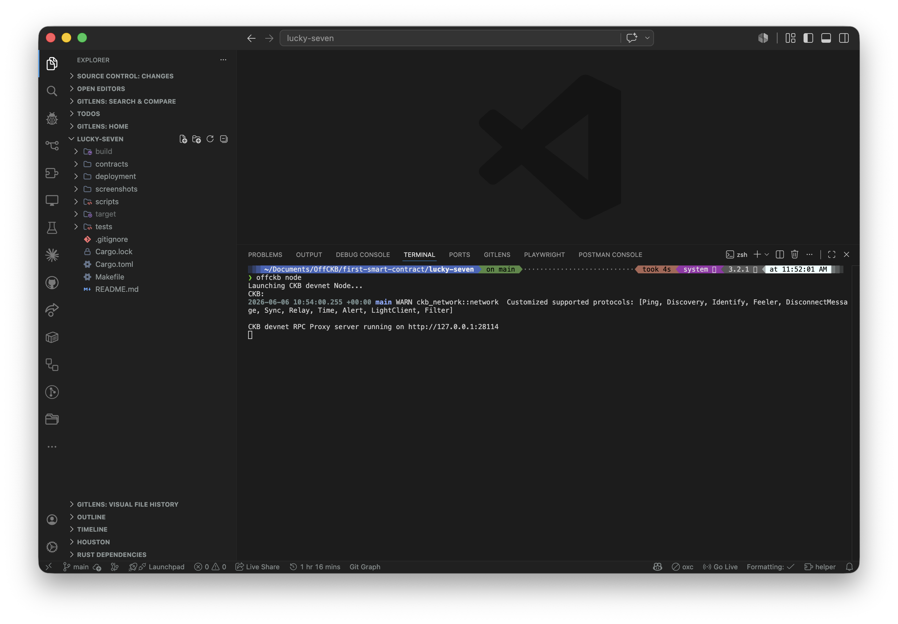
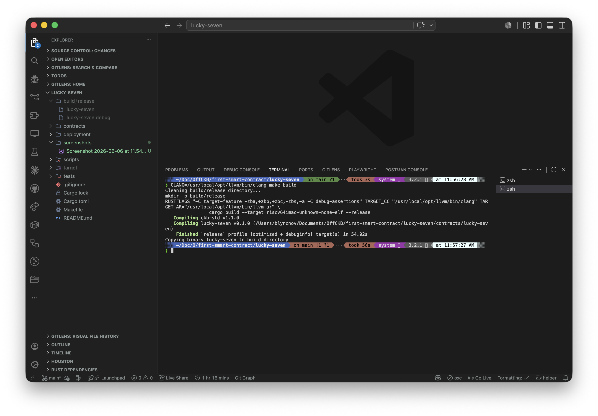
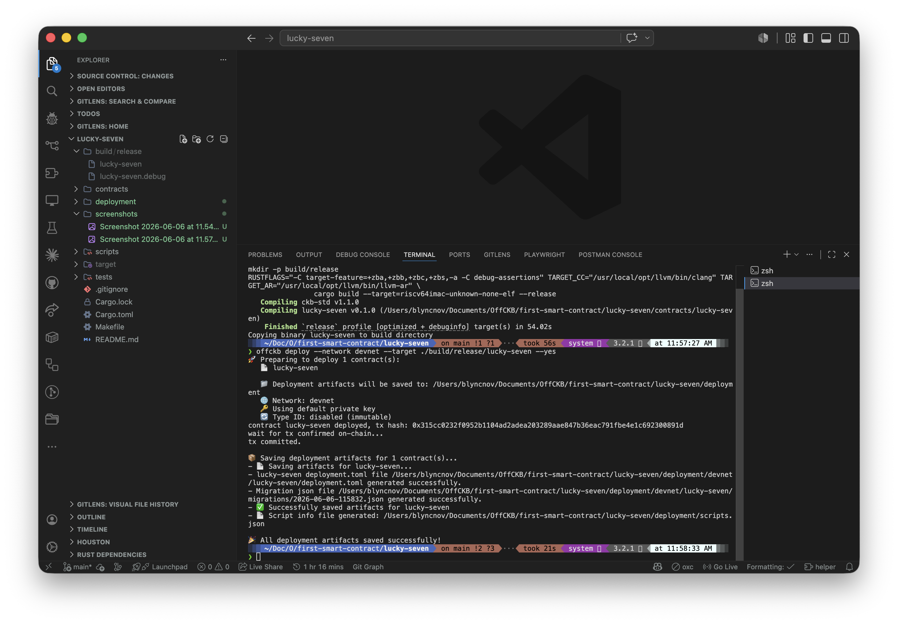
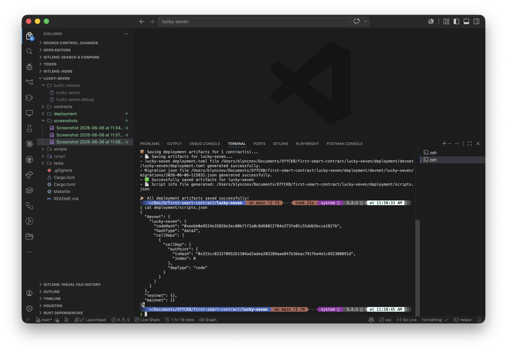

# Lucky Seven

A very small smart contract for the CKB blockchain. It is my first contract, built with [OffCKB](https://github.com/nervosnetwork/offckb).

## What it does

It is a **lock script**. A lock script is the small program that decides if a cell on CKB can be unlocked.

This one has one rule:

> The cell can only be unlocked if the script `args` contain the byte `0x07` (the lucky seven).

If 7 is in the args, the script returns `0` (success). If not, it returns an error code.

That's it. Small, but it actually shows how a CKB script works: load the script, read the args, decide.

## The code

The full logic is in [`contracts/lucky-seven/src/main.rs`](contracts/lucky-seven/src/main.rs). The important part:

```rust
const LUCKY_BYTE: u8 = 0x07;

pub fn program_entry() -> i8 {
    let script = load_script().unwrap();
    let args = script.args().raw_data();

    if args.is_empty() {
        return 5; // no args at all
    }

    if args.iter().any(|b| *b == LUCKY_BYTE) {
        0 // lucky, unlock
    } else {
        7 // not lucky, reject
    }
}
```

## Proof of deployment

This contract is deployed live on a local OffCKB devnet. Here is the on-chain info, the artifacts, and the screenshots of the steps.

### Deployment info (devnet)

| | |
|---|---|
| Network | OffCKB devnet |
| Deploy date | 2026-06-06 |
| Tx hash | `0x315cc0232f0952b1104ad2adea203289aae847b36eac791fbe4e1c692300891d` |
| Code hash | `0xeebb0a9524e35826e3ec80bf1f2a0c8d68022704e373fe01c55ddb5bcca1827b` |
| Hash type | `data2` |
| Cell dep out-point index | `0` |
| Binary size | 45,984 bytes |
| Binary format | `ELF 64-bit LSB executable, UCB RISC-V, RVC, soft-float ABI` |
| Deployer address | `ckt1qzda0cr08m85hc8jlnfp3zer7xulejywt49kt2rr0vthywaa50xwsqvwg2cen8extgq8s5puft8vf40px3f599cytcyd8` (offckb account #0) |

Generated deployment artifacts (also in this repo):
- [`deployment/scripts.json`](deployment/scripts.json) — code hash + cell dep
- [`deployment/devnet/lucky-seven/deployment.toml`](deployment/devnet/lucky-seven/deployment.toml) — full deploy config
- [`deployment/devnet/lucky-seven/migrations/`](deployment/devnet/lucky-seven/migrations/) — migration record

### Screenshots

Each step of the build and deploy is shown below. Files live in [`screenshots/`](screenshots/).

| Step | What it shows | Screenshot |
|---|---|---|
| 1 | OffCKB devnet running on `127.0.0.1:28114` |  |
| 2 | RISC-V binary built, `file` output confirming target |  |
| 3 | `offckb deploy` output with tx hash + "tx committed" |  |
| 4 | `deployment/scripts.json` showing the on-chain code hash |  |

## How to run it yourself

You need: Node.js 20+, Rust, the `riscv64imac-unknown-none-elf` target, `cargo-generate`, and `clang 16+` with the RISC-V backend (on macOS, install with `brew install llvm`).

1. Install OffCKB:
   ```
   npm install -g @offckb/cli
   ```

2. Start the devnet (leave it running):
   ```
   offckb node
   ```

3. Build the contract:
   ```
   CLANG=/usr/local/opt/llvm/bin/clang make build
   ```

4. Deploy it:
   ```
   offckb deploy --network devnet --target ./build/release/lucky-seven --yes
   ```

You should see a tx hash and "tx committed."
